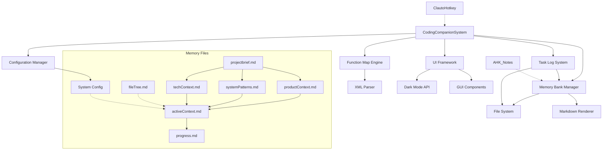
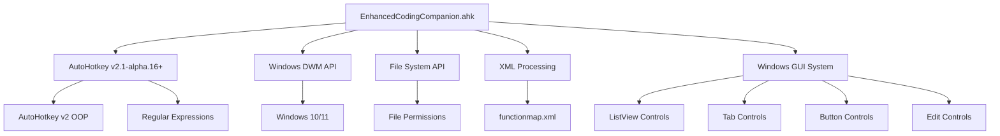

# File Tree: Enhanced Coding Companion System

## Project Structure

```
ClautoHotkey/
├── EnhancedCodingCompanion.ahk     # Main system script
├── functionmap.xml                 # Function definitions and organization
├── system.log                      # System operation log (created at runtime)
├── memory_docs/                    # Memory bank directory
│   ├── activeContext.md            # Current work focus and decisions
│   ├── fileTree.md                 # This file - project structure documentation
│   ├── productContext.md           # Why this project exists and problems it solves
│   ├── progress.md                 # What works and what's left to build
│   ├── projectbrief.md             # Core requirements and goals
│   ├── systemPatterns.md           # System architecture and design patterns
│   ├── system_config.md            # System mode and configuration
│   └── techContext.md              # Technologies and dependencies
├── .cursor/                        # Integration with Cursor AI assistant
│   └── task-logs/                  # Task logging directory
│       └── *.md                    # Individual task log files (created at runtime)
├── memory-bank/                    # Original memory bank files (for reference)
│   └── *.md                        # Original memory bank content
└── Context_Creator.ahk             # Module content merger utility
```

## Integration with Existing Components

```
AHK_Running/
├── Lib/                            # AutoHotkey library directory
│   └── *.ahk                       # Library files
├── AHK_Notes/                      # Knowledge base component
│   ├── Classes/                    # Class documentation
│   ├── Concepts/                   # Concept documentation
│   ├── Methods/                    # Method documentation
│   ├── Patterns/                   # Pattern documentation
│   ├── Snippets/                   # Code snippets
│   └── Templates/                  # Documentation templates
└── ClautoHotkey/                   # Our system location
    └── ...                         # Files described above
```

## Component Relationships



## File Purpose Summary

| File | Purpose | Mode |
|------|---------|------|
| EnhancedCodingCompanion.ahk | Main system script that initializes all components | Both |
| functionmap.xml | Defines functions, phases, and workflows | Both |
| memory_docs/projectbrief.md | Core requirements and project goals | Both |
| memory_docs/activeContext.md | Current focus and recent decisions | Both |
| memory_docs/progress.md | Implementation status and known issues | Both |
| memory_docs/system_config.md | System mode and configuration settings | Both |
| memory_docs/fileTree.md | Project structure documentation | Both |
| memory_docs/productContext.md | Product purpose and problems it solves | FULL |
| memory_docs/systemPatterns.md | System architecture and design patterns | FULL |
| memory_docs/techContext.md | Technical environment and dependencies | FULL |
| .cursor/task-logs/*.md | Individual task implementation logs | Both |

## Dependency Graph



## Directory Growth Plan

As the project evolves, additional directories may be added:

1. **plugins/**: For system extensions and additional functionality
2. **templates/**: For custom memory bank file templates
3. **themes/**: For UI customization and theme options
4. **backups/**: For automatic memory bank backups
5. **exports/**: For memory bank content export files
