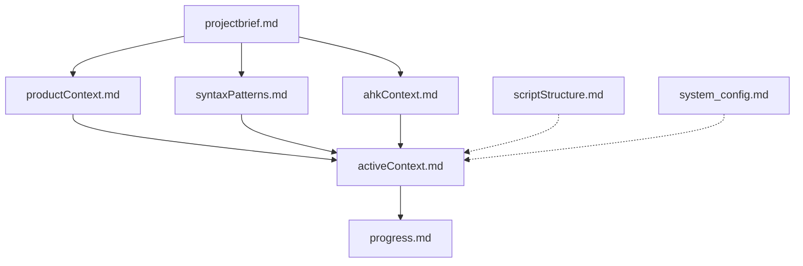
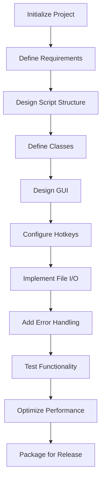

# AutoHotkey v2 Coding Companion System

```cpp
#Requires AutoHotkey v2.1-alpha.16
#SingleInstance Force

AutoHotkeyCompanion()
class AutoHotkeyCompanion {
    static Mode := "FULL"
    static Config := Map(
        "version", "1.0",
        "defaultMemoryPath", A_ScriptDir "\memory_docs\"
    )
    
    __New() {
        this.InitializeSystem()
        this.DisplayWelcome()
    }
    
    InitializeSystem() {
        if !DirExist(AutoHotkeyCompanion.Config["defaultMemoryPath"])
            DirCreate(AutoHotkeyCompanion.Config["defaultMemoryPath"])
            
        this.LoadMemoryBank()
    }
    
    LoadMemoryBank() {
        this.memoryBank := Map()
        Loop Files, AutoHotkeyCompanion.Config["defaultMemoryPath"] "*.md"
            this.memoryBank[A_LoopFileName] := FileRead(A_LoopFilePath)
    }
    
    DisplayWelcome() {
        MsgBox("AHK v2 Coding Companion System Initialized`n`nMode: " 
               AutoHotkeyCompanion.Mode "`nMemory Files: " this.memoryBank.Count)
    }
}
```

## Memory Bank Structure for AHK v2 Projects



### Core Files

1. **`projectbrief.md`**
   - Project purpose and requirements
   - Target functionality and user experience
   - Feature priorities and roadmap

2. **`productContext.md`**
   - Script's purpose and target users 
   - Problems the script addresses
   - Workflow integration details
   - User interaction expectations

3. **`syntaxPatterns.md`**
   - AHK v2 syntax patterns used in the project
   - Established code conventions
   - Common design patterns (e.g., OOP, event handlers)
   - Component relationships

4. **`ahkContext.md`**
   - AHK v2 features needed for this project
   - Required libraries and dependencies
   - Version requirements
   - Environment setup

5. **`activeContext.md`**
   - Current development focus
   - Open issues or challenges
   - Recent changes to the script
   - Next development steps

6. **`progress.md`**
   - Working features
   - Pending features
   - Known issues
   - Testing results

7. **`scriptStructure.md`**
   - Script file organization
   - Class hierarchies
   - Function relationships
   - Hotkey and hotstring maps

8. **`system_config.md`**
   - Mode configuration (LITE/FULL)
   - Script-specific settings
   - Project preferences
   - Custom workflow configurations

## Function Map for AHK v2 Development

```xml
<FunctionMap>
  <!-- AHK Project Structure Functions -->
  <StructureFunctions>
    <Function id="createScriptHeader">Create standard AHK v2 script header with requirements</Function>
    <Function id="createClassStructure">Define class hierarchy and relationships</Function>
    <Function id="createGUILayout">Design GUI layout and control structure</Function>
    <Function id="createErrorHandling">Implement AHK v2 error handling system</Function>
    <Function id="createHotkeyMap">Design hotkey and hotstring organization</Function>
    <Function id="createFileIO">Establish file operations and data persistence</Function>
    <Function id="createEventSystem">Design event-driven architecture</Function>
  </StructureFunctions>
  
  <!-- AHK Implementation Functions -->
  <ImplementationFunctions>
    <Function id="implementClasses">Create object-oriented class implementations</Function>
    <Function id="implementGUI">Build GUI with proper control structure</Function>
    <Function id="implementHotkeys">Configure hotkeys with proper context sensitivity</Function>
    <Function id="implementErrorTrap">Add try-catch blocks and error recovery</Function>
    <Function id="implementFileHandling">Add file operations with error handling</Function>
    <Function id="implementDataStructures">Build Maps and Arrays with proper methods</Function>
    <Function id="implementCallbacks">Create properly bound callbacks and event handlers</Function>
  </ImplementationFunctions>
  
  <!-- AHK Testing Functions -->
  <TestingFunctions>
    <Function id="testHotkeys">Verify hotkey functionality</Function>
    <Function id="testGUI">Test GUI operation and event handling</Function>
    <Function id="testFileIO">Validate file operations</Function>
    <Function id="testErrorRecovery">Simulate errors and test recovery</Function>
    <Function id="testEdgeCases">Test boundary conditions and special cases</Function>
    <Function id="testUserFlow">Verify end-to-end user workflows</Function>
  </TestingFunctions>
  
  <!-- AHK Optimization Functions -->
  <OptimizationFunctions>
    <Function id="optimizeHotkeys">Refine hotkey implementation for performance</Function>
    <Function id="optimizeGUI">Enhance GUI responsiveness and layout</Function>
    <Function id="optimizeMemory">Improve memory usage and object lifecycle</Function>
    <Function id="optimizeFileIO">Enhance file operation performance</Function>
    <Function id="refactorForClarity">Improve readability and maintainability</Function>
  </OptimizationFunctions>
</FunctionMap>
```

## AHK v2 Code Quality Standards

### 1. Syntax and Structure Requirements

```cpp
#Requires AutoHotkey v2.1-alpha.16
#SingleInstance Force

; Initialize main class
MainScript()

class MainScript {
    static Config := Map(
        "version", "1.0",
        "author", "AHK Developer"
    )
    
    __New() {
        this.data := Map()
        this.SetupGUI()
        this.RegisterHotkeys()
    }
    
    SetupGUI() {
        this.gui := Gui("+Resize", "AHK Application")
        this.gui.OnEvent("Close", (*) => this.gui.Hide())
        this.gui.OnEvent("Escape", (*) => this.gui.Hide())
        
        this.gui.AddText("w200", "Enter data:")
        this.inputField := this.gui.AddEdit("w200")
        this.submitButton := this.gui.AddButton("Default", "Submit")
            .OnEvent("Click", this.ProcessInput.Bind(this))
    }
    
    ProcessInput(*) {
        input := this.inputField.Value
        try {
            this.data["lastInput"] := input
            MsgBox("Input processed: " input)
        } catch as err {
            MsgBox("Error: " err.Message)
        }
    }
    
    RegisterHotkeys() {
        Hotkey("^!r", (*) => Reload())
        Hotkey("^!p", this.ShowGUI.Bind(this))
    }
    
    ShowGUI(*) => this.gui.Show()
}
```

### 2. AHK v2 Data Structure Guidelines

```cpp
; CORRECT - Use Map() for key-value data
settings := Map(
    "width", 800,
    "height", 600,
    "title", "My Application"
)

; CORRECT - Use Array for sequential data
items := ["apple", "banana", "orange"]

; CORRECT - Proper object-oriented approach
class Configuration {
    static Defaults := Map(
        "theme", "dark",
        "fontSize", 12,
        "autoSave", true
    )
    
    __New(customSettings := "") {
        this.settings := Configuration.Defaults.Clone()
        if customSettings is Map
            for key, value in customSettings
                this.settings[key] := value
    }
    
    GetSetting(key) => this.settings.Has(key) ? this.settings[key] : ""
    
    SetSetting(key, value) {
        this.settings[key] := value
        return value
    }
}
```

### 3. AHK v2 Error Handling Framework

```cpp
class ErrorHandler {
    static ErrorTypes := Map(
        "FileError", "Error related to file operations",
        "InputError", "Error related to user input",
        "NetworkError", "Error related to network operations",
        "SystemError", "Error related to system operations"
    )
    
    static LogError(errorType, message, source := "") {
        if !ErrorHandler.ErrorTypes.Has(errorType)
            errorType := "UnknownError"
            
        logEntry := FormatTime(, "yyyy-MM-dd HH:mm:ss") " | " 
                  . errorType " | " source " | " message
                  
        try {
            FileAppend(logEntry "`n", "error_log.txt")
        } catch {
            ; Fallback if file write fails
            OutputDebug(logEntry)
        }
        
        return logEntry
    }
    
    static Handle(err, context := "") {
        errorType := Type(err)
        
        switch errorType {
            case "OSError":
                return ErrorHandler.LogError("FileError", err.Message, context)
            case "TargetError":
                return ErrorHandler.LogError("SystemError", err.Message, context)
            case "TypeError", "ValueError":
                return ErrorHandler.LogError("InputError", err.Message, context)
            default:
                return ErrorHandler.LogError("UnknownError", err.Message, context)
        }
    }
}

; Usage example
try {
    FileRead("nonexistent.txt")
} catch as err {
    errorInfo := ErrorHandler.Handle(err, "FileRead operation")
    MsgBox("An error occurred. See log for details.")
}
```

### 4. AHK v2 GUI Best Practices

```cpp
class ModernGUI {
    static ThemeColors := Map(
        "dark", Map(
            "background", "#1E1E1E",
            "text", "#FFFFFF",
            "accent", "#0078D7"
        ),
        "light", Map(
            "background", "#F0F0F0",
            "text", "#000000",
            "accent", "#0078D7"
        )
    )
    
    __New(title := "Modern GUI", theme := "light") {
        this.theme := theme
        this.controls := Map()
        
        this.gui := Gui("+Resize +MinSize400x300", title)
        this.gui.MarginX := 15
        this.gui.MarginY := 15
        
        this.SetupEvents()
        this.CreateLayout()
    }
    
    SetupEvents() {
        this.gui.OnEvent("Close", (*) => this.gui.Hide())
        this.gui.OnEvent("Escape", (*) => this.gui.Hide())
        this.gui.OnEvent("Size", this.HandleResize.Bind(this))
    }
    
    CreateLayout() {
        ; Header
        this.controls["header"] := this.gui.AddText("xm w100% h30 +Center", "Welcome")
        
        ; Content area
        this.controls["content"] := this.gui.AddEdit("xm w100% h150 +Multi")
        
        ; Button row
        this.controls["ok"] := this.gui.AddButton("xm w80", "OK")
            .OnEvent("Click", this.OnOK.Bind(this))
            
        this.controls["cancel"] := this.gui.AddButton("x+10 w80", "Cancel")
            .OnEvent("Click", (*) => this.gui.Hide())
    }
    
    HandleResize(thisGui, minMax, width, height) {
        if minMax = -1
            return
            
        this.controls["header"].Move(,, width - 30)
        this.controls["content"].Move(,, width - 30, height - 120)
    }
    
    OnOK(*) {
        data := this.controls["content"].Value
        if data
            MsgBox("You entered: " data)
        else
            MsgBox("Please enter some data")
    }
    
    Show() => this.gui.Show()
}

; Usage
myGui := ModernGUI("My Application")
myGui.Show()
```

## AHK v2 Best Practices

1. **Script Organization**
   - Use proper #Requires directives
   - Initialize classes at script start
   - Group related functionality in classes
   - Separate GUI, logic, and data management

2. **Syntax Standards**
   - Use `:=` for assignments
   - Use `=>` only for simple expressions
   - Use `.Bind(this)` for callbacks
   - Avoid global variables
   - Use Map() instead of object literals

3. **Error Handling**
   - Use try/catch blocks for risky operations
   - Implement specific error types
   - Log errors with context information
   - Provide user-friendly error messages
   - Add fallback behavior for critical operations

4. **GUI Development**
   - Implement responsive layouts
   - Use consistent control naming
   - Store controls in Maps for easy access
   - Bind event handlers correctly
   - Implement proper window management

5. **Performance Optimization**
   - Minimize global variables
   - Avoid unnecessary loops
   - Use efficient data structures
   - Clean up timers and hotkeys
   - Implement proper object lifecycle management

## Workflow for AHK v2 Development



## Implementation Checklist for AHK v2 Projects

1. **Pre-Implementation**
   - [ ] Project requirements defined
   - [ ] User workflows mapped
   - [ ] Script architecture designed
   - [ ] Class hierarchy planned
   - [ ] GUI layout sketched
   - [ ] File structure organized

2. **Implementation**
   - [ ] Script header and directives
   - [ ] Class definitions
   - [ ] Data structure setup
   - [ ] GUI implementation
   - [ ] Event handlers and callbacks
   - [ ] Hotkey configuration
   - [ ] File operations
   - [ ] Error handling

3. **Testing**
   - [ ] Basic functionality
   - [ ] GUI operation
   - [ ] Hotkey responsiveness
   - [ ] Error recovery
   - [ ] Edge cases
   - [ ] User workflow testing
   - [ ] Performance testing

4. **Finalization**
   - [ ] Code cleanup
   - [ ] Documentation
   - [ ] Optimization
   - [ ] Packaging for distribution
   - [ ] Installation instructions

## Extension for Practical Use

To make this system practically usable, implement this AHK v2 script:

```cpp
#Requires AutoHotkey v2.1-alpha.16
#SingleInstance Force

AHKCompanionSystem()
class AHKCompanionSystem {
    static MemoryPath := A_ScriptDir "\memory_docs\"
    static ProjectPath := A_ScriptDir "\projects\"
    static TemplatesPath := A_ScriptDir "\templates\"
    static Config := Map(
        "version", "1.0",
        "mode", "FULL",
        "editor", "notepad.exe"
    )
    
    __New() {
        this.EnsureFolders()
        this.LoadConfiguration()
        this.CreateGUI()
    }
    
    EnsureFolders() {
        for _, path in [AHKCompanionSystem.MemoryPath, 
                       AHKCompanionSystem.ProjectPath, 
                       AHKCompanionSystem.TemplatesPath]
            if !DirExist(path)
                DirCreate(path)
    }
    
    LoadConfiguration() {
        configFile := AHKCompanionSystem.MemoryPath "system_config.md"
        if FileExist(configFile) {
            try {
                content := FileRead(configFile)
                if InStr(content, "Mode: LITE")
                    AHKCompanionSystem.Config["mode"] := "LITE"
            }
        } else {
            this.CreateDefaultConfig()
        }
    }
    
    CreateDefaultConfig() {
        content := "# AHK Companion System Configuration`n`n"
               . "Mode: " AHKCompanionSystem.Config["mode"] "`n"
               . "Version: " AHKCompanionSystem.Config["version"] "`n"
               . "Editor: " AHKCompanionSystem.Config["editor"]
        
        FileOpen(AHKCompanionSystem.MemoryPath "system_config.md", "w").Write(content).Close()
    }
    
    CreateGUI() {
        this.gui := Gui("+Resize", "AHK v2 Coding Companion")
        this.gui.OnEvent("Close", (*) => this.gui.Hide())
        this.gui.OnEvent("Escape", (*) => this.gui.Hide())
        
        this.gui.SetFont("s10")
        this.gui.AddText("w400 Center", "AutoHotkey v2 Coding Companion System")
        this.gui.AddText("w400 Center", "Mode: " AHKCompanionSystem.Config["mode"])
        
        this.gui.AddButton("w200 h30", "New Project")
            .OnEvent("Click", this.CreateNewProject.Bind(this))
        
        this.gui.AddButton("w200 h30", "Open Project")
            .OnEvent("Click", this.OpenProject.Bind(this))
            
        this.gui.AddButton("w200 h30", "Memory Bank")
            .OnEvent("Click", this.OpenMemoryBank.Bind(this))
            
        this.gui.AddButton("w200 h30", "Settings")
            .OnEvent("Click", this.OpenSettings.Bind(this))
            
        this.gui.Show()
    }
    
    CreateNewProject(*) {
        projectName := InputBox("Enter project name:", "New Project").Value
        if !projectName
            return
            
        projectFolder := AHKCompanionSystem.ProjectPath projectName
        if DirExist(projectFolder) {
            MsgBox("Project already exists.", "Error", "Icon!")
            return
        }
        
        DirCreate(projectFolder)
        
        template := FileRead(AHKCompanionSystem.TemplatesPath "basic_script.ahk")
        FileOpen(projectFolder "\" projectName ".ahk", "w").Write(template).Close()
        
        this.CreateProjectMemory(projectName)
        Run(AHKCompanionSystem.Config["editor"] " " projectFolder "\" projectName ".ahk")
    }
    
    CreateProjectMemory(projectName) {
        memoryFolder := AHKCompanionSystem.MemoryPath projectName
        DirCreate(memoryFolder)
        
        defaultFiles := Map(
            "projectbrief.md", "# " projectName " - Project Brief`n`n## Purpose`n`n## Requirements`n`n## Features",
            "activeContext.md", "# " projectName " - Active Context`n`n## Current Focus`n`n## Recent Changes`n`n## Next Steps",
            "progress.md", "# " projectName " - Progress`n`n## Completed`n`n## In Progress`n`n## Pending`n`n## Issues"
        )
        
        if AHKCompanionSystem.Config["mode"] = "FULL" {
            defaultFiles["syntaxPatterns.md"] := "# " projectName " - Syntax Patterns`n`n## Class Structure`n`n## Event Handling`n`n## Data Management"
            defaultFiles["ahkContext.md"] := "# " projectName " - AHK Context`n`n## Version Requirements`n`n## Dependencies`n`n## Environment Setup"
            defaultFiles["productContext.md"] := "# " projectName " - Product Context`n`n## User Needs`n`n## Workflow Integration`n`n## User Experience"
            defaultFiles["scriptStructure.md"] := "# " projectName " - Script Structure`n`n## File Organization`n`n## Class Hierarchy`n`n## Function Map"
        }
        
        for filename, content in defaultFiles
            FileOpen(memoryFolder "\" filename, "w").Write(content).Close()
    }
    
    OpenProject(*) {
        projects := []
        Loop Files, AHKCompanionSystem.ProjectPath "*", "D"
            projects.Push(A_LoopFileName)
            
        if !projects.Length {
            MsgBox("No projects found.", "Information")
            return
        }
        
        projectGui := Gui(, "Select Project")
        projectList := projectGui.AddListBox("w300 h400 Choose1", projects)
        projectGui.AddButton("w300", "Open")
            .OnEvent("Click", (*) => (Run(AHKCompanionSystem.Config["editor"] " " 
                AHKCompanionSystem.ProjectPath projectList.Text "\" projectList.Text ".ahk"), 
                projectGui.Destroy()))
                
        projectGui.Show()
    }
    
    OpenMemoryBank(*) {
        projects := []
        Loop Files, AHKCompanionSystem.MemoryPath "*", "D"
            projects.Push(A_LoopFileName)
            
        if !projects.Length {
            MsgBox("No memory banks found.", "Information")
            return
        }
        
        memoryGui := Gui(, "Select Memory Bank")
        projectList := memoryGui.AddListBox("w300 h400 Choose1", projects)
        memoryGui.AddButton("w300", "Open")
            .OnEvent("Click", (*) => (Run("explorer " 
                AHKCompanionSystem.MemoryPath projectList.Text), 
                memoryGui.Destroy()))
                
        memoryGui.Show()
    }
    
    OpenSettings(*) {
        settingsGui := Gui(, "Settings")
        settingsGui.AddText("w300", "System Mode:")
        
        modeDropdown := settingsGui.AddDropDownList("w300 Choose" 
            (AHKCompanionSystem.Config["mode"] = "FULL" ? "1" : "2"), ["FULL", "LITE"])
            
        settingsGui.AddText("w300", "Editor:")
        editorInput := settingsGui.AddEdit("w300", AHKCompanionSystem.Config["editor"])
        
        settingsGui.AddButton("w300", "Save")
            .OnEvent("Click", (*) => (
                AHKCompanionSystem.Config["mode"] := modeDropdown.Text,
                AHKCompanionSystem.Config["editor"] := editorInput.Text,
                this.SaveConfiguration(),
                settingsGui.Destroy(),
                MsgBox("Settings saved. Restart the application for changes to take effect.")
            ))
            
        settingsGui.Show()
    }
    
    SaveConfiguration() {
        content := "# AHK Companion System Configuration`n`n"
               . "Mode: " AHKCompanionSystem.Config["mode"] "`n"
               . "Version: " AHKCompanionSystem.Config["version"] "`n"
               . "Editor: " AHKCompanionSystem.Config["editor"]
        
        FileOpen(AHKCompanionSystem.MemoryPath "system_config.md", "w").Write(content).Close()
    }
}
```

This system provides:
- Project creation with templates
- Memory bank management 
- Settings configuration
- GUI interface for common operations
- Support for both LITE and FULL modes

To complete the system, create these template files:

1. **Basic Script Template** (`templates/basic_script.ahk`):

```cpp
#Requires AutoHotkey v2.1-alpha.16
#SingleInstance Force

; Script Name: %ProjectName%
; Description: Basic AHK script
; Author: AHK Developer
; Version: 1.0

%ProjectName%()
class %ProjectName% {
    __New() {
        this.CreateGUI()
        this.RegisterHotkeys()
    }
    
    CreateGUI() {
        this.gui := Gui(, "%ProjectName%")
        this.gui.OnEvent("Close", (*) => this.gui.Hide())
        this.gui.OnEvent("Escape", (*) => this.gui.Hide())
        
        this.gui.AddText("w300", "Hello World")
        this.gui.AddButton("w100", "OK")
            .OnEvent("Click", (*) => this.gui.Hide())
    }
    
    RegisterHotkeys() {
        Hotkey("^!p", this.ShowGUI.Bind(this))
    }
    
    ShowGUI(*) => this.gui.Show()
}
```