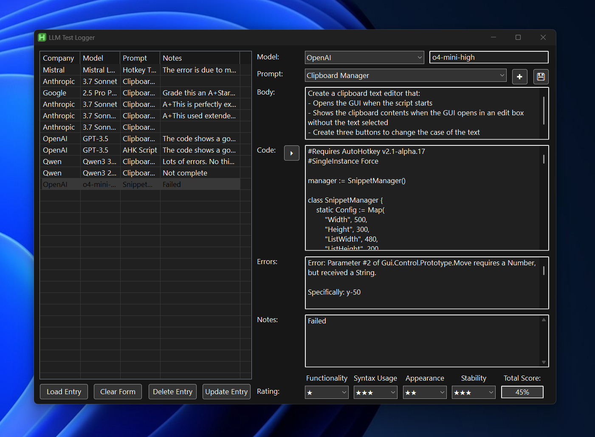
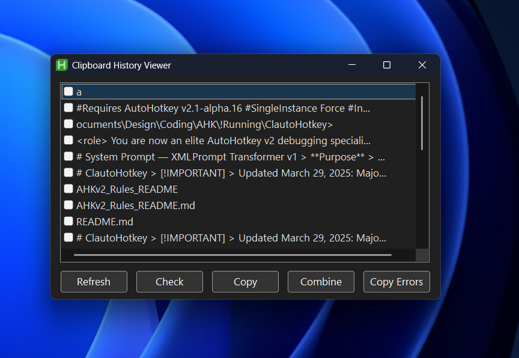
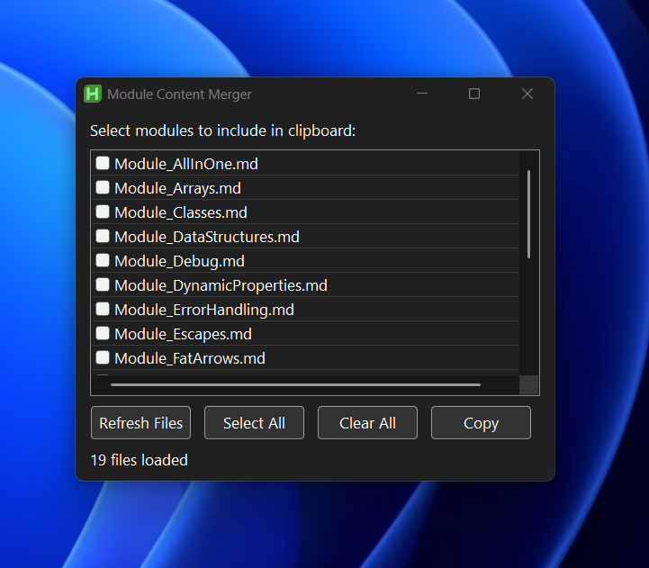

# ClautoHotkey: AHK v2 Coding Agent

>[!IMPORTANT] 
>This readme was not created using AI, so it's worth reading lol

ClautoHotkey is a suite of prompts, modules, and scripts for AutoHotkey v2 development when using AI. There are structured instructions, debugging tools, and strict coding guidelines to help generate high-quality, maintainable, and object-oriented AHK v2 code.

## ✨ Key Features

* Prompt Engineering: The main instruction prompts and supplemental modules are designed with current best practices in structure and language to invoke tools and proper chain of thought methods (`Module_Instructions.md`, `Module_AllInOne.md`, `Context_Claude.md`) for guiding AI models in AHK v2 code generation.
* Structured Coding Rules: The prompts & modules also provide in-depth rules for the LLMs to adhere to that reduce AHK v2 errors significantly.
* Cline/Cursor Support: Features Clinerules files and Cursor instructions for those who use that them. I don't currently use either that often but I have set them up to test.  
* Development Helper GUIs: Utilities logging (`_UltiLog.ahk`), context management (`Context_Creator.ahk`), feeding the LLM error messages (`Scripts/ClipboardHistoryCombiner.ahk`),  and updating your code with changes made in an LLM's GUI (`Scripts/Clip_SearchCode.ahk`)
* AHK_Notes: This is a ton of notes taken from all kinds of different places. I have an LLM that I feel posts/comments/chats/repos in to and it feeds them into this folder. 
* AHK-Server: If you see references to this, I am working on an MCP server using Typescript but would be cool with changing to Python if there's people who want to help with Python dev. The server's goal is to be able to pass in the information in `ClautoHotkey/Data` to provide the prompts and modules just like this repo but directly into a LLM. This will include LLM style linting (you can only do so much) to debug any problems in the script. Please help me lol ([ahk-server](https://github.com/TrueCrimeAudit/ahk-mcp/tree/main%29)).
* AHK v2 Support: This is only for AHK v2. I won't make anything for v1. Why? Don't wanna. Should you switch to v2? Yes. Why? It's better
* 

## Getting Started

1. **Prerequisites:**
   * AutoHotkey v2.x installed.
   * If you have AutoHotkey v1 installed, uninstall. It doesn't change anything, but you can do it, just use AHK v2 fully. 
2. **Setup:**
   * Clone this repository to your local machine using `git clone https://github.com/TrueCrimeAudit/ClautoHotkey.git`
   * Integrate the `System_Prompts` and `Modules` directories into your AI assistant's context or knowledge base.
   * Refer to `Cline/Using_Cline_for_AHKv2.md` for specific integration instructions if you are using the Cline environment.

## Components

### Prompting & Instruction System

These modules provide the core intelligence for guiding AI models to generate precise and compliant AHK v2 code.

* `Modules/Module_Instructions.md`: The foundational instruction set for the AHK coding agent. This is tailored based on the newest Claude models best practices. This references modules, so make sure you're using a LLM provider that lets you upload modules to be properly referenced by their full filename. 
* `Modules/Module_AllInOne.md`: A consolidated reference containing AHK v2 knowledge, syntax rules, and best practices, but inside one file, this makes it easier for quick context setup when testing a new LLM.
* `Context_Claude.md`: A specialized context file tailored for interactions with Claude, ensuring it adheres to specific AHK v2 OOP principles and uses affirmative language which is much more effective in Claude 4. 
* `common_prompts.json`: A collection of reusable prompt templates for common AHK v2 tasks, such as creating clipboard managers, file system watchers, and snippet managers. This is in JSON format because it's what I feed the UltimateLog with. 
* `.clinerules`: These files are obviously tailored to providing context and instructions to Cline.

## Helpful GUIs 

Here are some visual examples of the helper scripts in action:

### Ultimate Logger (`_UltiLog.ahk`)

The Ultimate Logger is a robust logging and prompt management tool. It features a GUI for reviewing AI interaction logs, managing prompt templates, executing AHK code snippets, and displaying errors. This is how Ilog all of my tests for each new LLM when it comes out. There is a four catagory grading system I use to log how good the script is and any errors the LLM produced. I am going to be adding some more functionality to this soon. 

### Clipboard History Combiner (`Scripts/ClipboardHistoryCombiner.ahk`)

This script provides a GUI to view and manage your Windows clipboard history. It allows you to select multiple clipboard items, combine them into a single text, and copy them back to the clipboard. It's particularly useful for copy and pasting errors from AHK. The "copy errors" button will copy all clipboards from the first clipboard until there's a clipboard that starts with "#Requires". This is useful to me because I copy all of my errors to my clipboard after copying and pasting the new script into VsCode. It also prefixes a prompt for the LLM to thinking through the errors when it reads the debugging information. This uses the clipboardhistory.ahk script from one of the 🐐 `https://github.com/nperovic`. 

### Context Creator (`Context_Creator.ahk`)

This is a simple way to combine your modules to make them easy to copy and paste into an LLM to start testing. Some new LLM providers don't have system prompt functionality or GUIs so I combine them and paste them into the context window.

### Clip Search Code (`Scripts/Clip_SearchCode.ahk`)

This is a script I put together to easily copy and paste sections of code in VsCode from the LLM GUIs. This helps me because it searches for the first line of the clipboard in the codebase and collapses the function/class and writes over it with the new code. This is possible by selecting the write areas in the LLM GUI by having a response style that will edit the code in chunks. Look at the response `Styles\Style_CodeArchitect.md` for an example of that. 

## 🤝 Contributing

Contributions are not only welcome but I beg for help with ahk-server lol. Pls help. 