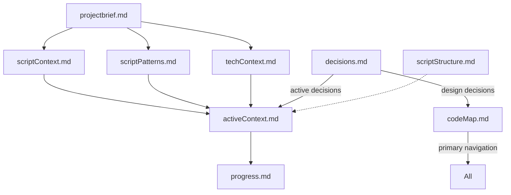
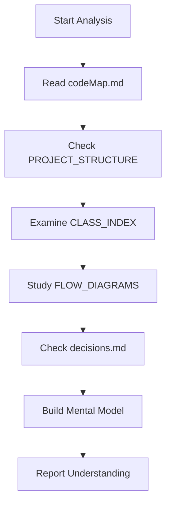
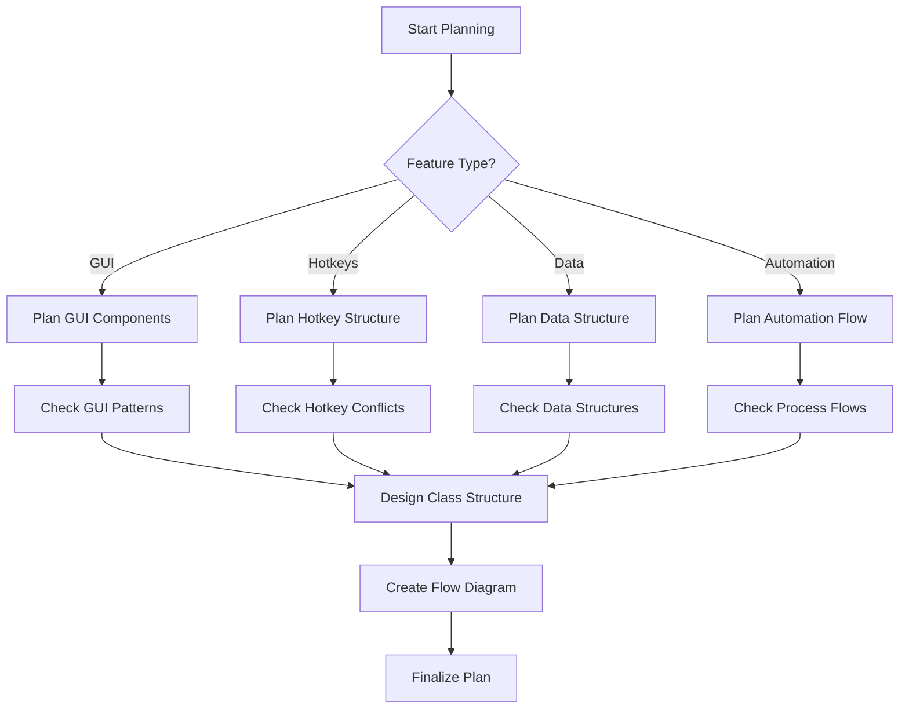
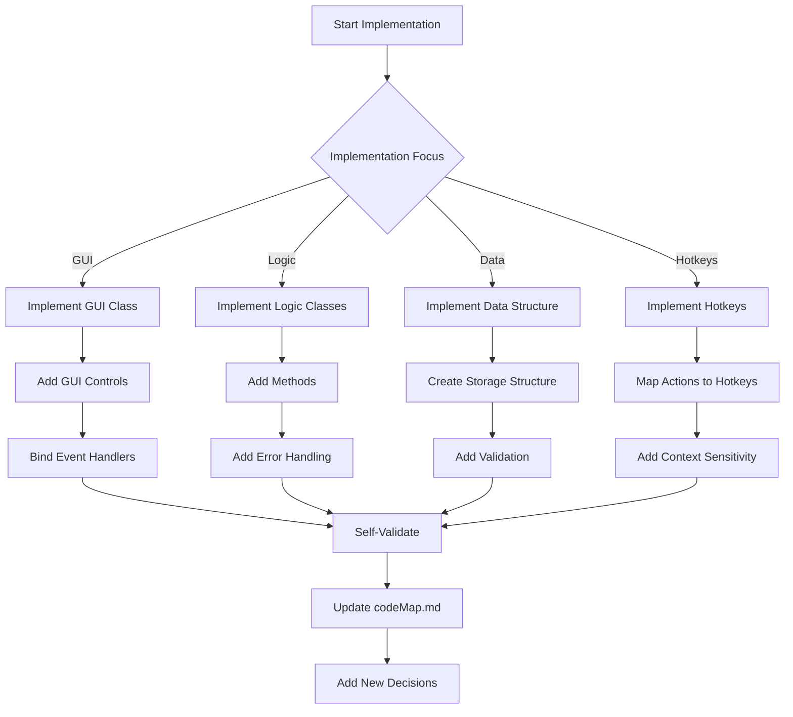
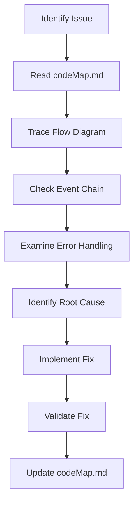

# AutoHotkey v2 Coding Agent System

I've created a specialized system for AutoHotkey v2 development that maintains perfect continuity between coding sessions through a comprehensive Memory Bank architecture. This system is designed specifically for the unique aspects of AHK v2 development, from OOP principles to GUI implementation to hotkey management.

```cpp
#Requires AutoHotkey v2.1-alpha.16
#SingleInstance Force

AHKAgent()
class AHKAgent {
    static Config := Map(
        "version", "1.0",
        "memoryPath", A_ScriptDir "\memory_bank\",
        "mode", "FULL"
    )

    __New() {
        this.EnsureMemoryBank()
        this.LoadContext()
        this.DisplayWelcome()
    }
    
    EnsureMemoryBank() {
        path := AHKAgent.Config["memoryPath"]
        if !DirExist(path)
            DirCreate(path)
    }
    
    LoadContext() {
        this.memoryFiles := Map()
        
        codeMapPath := AHKAgent.Config["memoryPath"] "codeMap.md"
        if FileExist(codeMapPath)
            this.memoryFiles["codeMap"] := FileRead(codeMapPath)
            
        activePath := AHKAgent.Config["memoryPath"] "activeContext.md"
        if FileExist(activePath)
            this.memoryFiles["activeContext"] := FileRead(activePath)
    }
    
    DisplayWelcome() {
        MsgBox("AHK v2 Coding Agent Initialized`n`n"
             . "Memory Files: " this.memoryFiles.Count "`n"
             . "Mode: " AHKAgent.Config["mode"])
    }
}
```

## Memory Bank Architecture



## Core Memory Bank Files

1. **`codeMap.md`** - The central knowledge base containing script structure, function index, and flow diagrams
   - The primary navigation tool loaded first in every session
   - Contains hierarchical representation of script components
   - Maps class relationships, method definitions, and dependencies
   - Includes AHK-specific metadata like hotkey mappings

2. **`projectbrief.md`** - Core definition of the AHK project goals and requirements
   - Script purpose and audience
   - Core functionality requirements
   - User experience expectations
   - Integration requirements with other systems

3. **`scriptContext.md`** - Problem domain and workflow integration
   - User workflows the script addresses
   - Environment integration details
   - User experience expectations
   - Automation goals and usage patterns

4. **`scriptPatterns.md`** - AHK v2 design patterns and component architecture
   - Class organization and inheritance patterns
   - Event handling architecture
   - GUI design patterns
   - Hotkey organization principles
   - Control flow standards

5. **`activeContext.md`** - Current development focus and priorities
   - Current development tasks
   - Recent changes to the script
   - Known issues being addressed
   - Immediate next steps

6. **`techContext.md`** - AHK v2 technical environment and constraints
   - AHK version requirements
   - Dependencies and libraries
   - Target environment characteristics
   - Performance considerations
   - External system integration details

7. **`progress.md`** - Script development status
   - Working features
   - Features in progress
   - Pending features
   - Known issues and their status
   - Testing results

8. **`decisions.md`** - Key design and implementation decisions
   - Architectural choices with rationale
   - Pattern selection decisions
   - Trade-offs made for specific implementations
   - Historical context for implementation approaches

9. **`scriptStructure.md`** - Detailed script organization
   - File structure and organization
   - Class hierarchy diagram
   - Function relationships
   - Hotkey and hotstring maps
   - Resource organization

## Smart Navigation System: codeMap.md

The `codeMap.md` file is the neural network of the AHK project, providing efficient access to all script components and their relationships.

### Structure and Format

```markdown
# AHK v2 CodeMap

## PROJECT_STRUCTURE
[root_directory]/
  [main_script.ahk] #[SCRIPT_ID] "Main entry point" @patterns[[MVC]]
  [lib_directory]/ [LIB]
    [class_file].ahk #[CLASS_ID] "Class definition" @patterns[[AHKClass]]
    [utility_file].ahk #[UTIL_ID] "Helper functions" @key @deps[[COMMON_ID]]
  [gui_directory]/ [GUI]
    [gui_component].ahk #[GUI_ID] "GUI component" @patterns[[AHKGui]]
  [data_directory]/ [DATA]
    [data_file].ahk #[DATA_ID] "Data model" @patterns[[AHKData]]
  [config_directory]/ [CONFIG]
    [config_file].ahk #[CONFIG_ID] "Configuration" @patterns[[AHKConfig]]

## CLASS_INDEX

```yaml
classes:
  #[CLASS_ID]:
    name: ClassName
    extends: BaseClassName
    file: [file_path]
    properties:
      - propertyName: type
      - _internalVar: type
    static:
      - StaticProp: type
      - Config: Map
    methods:
      - __New(param1, param2):
          description: "Constructor"
          parameters:
            - param1: type
            - param2: type
      - MethodName(param):
          description: "Method description"
          parameters:
            - param: type
          returns: returnType
          calls:
            - #[UTIL_ID].UtilityFunction
          throws:
            - type: Error
              when: "condition"
    events:
      - OnEvent1:
          bound_to: this.HandleEvent1.Bind(this)
          parameters:
            - sender: Object
            - eventInfo: Object

guis:
  #[GUI_ID]:
    name: GuiName
    file: [file_path]
    controls:
      - name: controlName
        type: Button
        options: "w200 h30"
        events:
          - Click: this.HandleClick.Bind(this)
      - name: inputField
        type: Edit
        options: "w200"
    hotkeys:
      - "^!g": this.Show.Bind(this)
      - "Escape": "when active triggers Hide"

utilities:
  #[UTIL_ID]:
    name: UtilityName
    file: [file_path]
    functions:
      - FormatText(text, options):
          description: "Formats text according to options"
          parameters:
            - text: String
            - options: Map
          returns: String
          called_by:
            - #[CLASS_ID].MethodName
      - ProcessData(data):
          description: "Processes data structure"
          parameters:
            - data: Array
          returns: Map
    hotkeys:
      - "^+r": ReloadScript

hotkeys:
  - "^!r": ReloadScript
  - "^!p": ShowMainWindow
  - "^!d": ToggleDebugMode
```

## FLOW_DIAGRAMS

### Main Application Flow
```mermaid
flowchart TD
  A[#[SCRIPT_ID]: AppStart] --> B[#[CLASS_ID]: AppInit]
  B --> C[#[GUI_ID]: CreateGUI]
  C --> D[#[CLASS_ID]: RegisterHotkeys]
  D --> E{User Input}
  E -->|Hotkey| F[#[CLASS_ID]: HotkeyHandler]
  E -->|GUI Event| G[#[GUI_ID]: EventHandler]
  F --> H[#[UTIL_ID]: ProcessAction]
  G --> H
  H --> I{Success?}
  I -->|Yes| J[#[GUI_ID]: UpdateDisplay]
  I -->|No| K[#[CLASS_ID]: HandleError]
```
```

## Progressive Decision Journal: decisions.md

```markdown
# AHK v2 Decision Journal

## Active Decisions
- [DATE] #[AHKARCH][001] "Class-based GUI Architecture" 
  - **Context**: Need to organize GUI components efficiently
  - **Options Considered**: 
    - Function-based approach: Simple but lacks encapsulation
    - Class-based approach: Better organization but more complex
  - **Decision**: Use class-based GUI architecture
  - **Rationale**: Provides better encapsulation and maintainability
  - **Components Affected**: #[GUI_ID], #[CLASS_ID]
  - **Decision Status**: Active

- [DATE] #[AHKDATA][001] "Map for Data Storage" 
  - **Context**: Need data structure for configuration
  - **Options Considered**: 
    - Object literals: Simpler syntax but high risk of errors
    - Maps: More explicit, better performance
  - **Decision**: Use Map() exclusively for key-value data
  - **Rationale**: Prevents common object literal syntax errors
  - **Components Affected**: #[DATA_ID], #[CONFIG_ID]
  - **Decision Status**: Active

## Historical Decisions
- [DATE] #[AHKCOMPAT][001] "Minimum AHK Version" 
  - **Context**: Need to ensure script compatibility
  - **Options Considered**: 
    - v2.0-beta: Broader compatibility
    - v2.1-alpha: Access to newer features
  - **Decision**: Require v2.1-alpha.16 or newer
  - **Rationale**: Need fat arrow functions and improved OOP
  - **Components Affected**: All
  - **Decision Status**: Implemented
```

## AHK v2 OOP Class Structure Guide

The class structure template provides the foundation for object-oriented AHK v2 development:

```cpp
class ClassName {
    ; Static properties (shared across all instances)
    static Config := Map(
        "setting1", "value1",
        "setting2", "value2"
    )
    
    ; Instance properties (unique to each instance)
    _propertyName := ""  ; Use underscore prefix for backing fields
    
    ; Constructor
    __New(param1, param2) {
        this._propertyName := param1
        this.InitializeComponents()
        this.RegisterEvents()
    }
    
    ; Property with getter/setter
    propertyName {
        get => this._propertyName
        set => this._propertyName := value
    }
    
    ; Regular method
    MethodName(param) {
        return this._propertyName param
    }
    
    ; Event handler (always use .Bind(this) in registration)
    HandleEvent(sender, eventInfo) {
        this._propertyName := eventInfo
    }
}
```

## GUI Framework Template

```cpp
class ApplicationGUI {
    ; GUI properties
    gui := ""
    controls := Map()
    
    ; Configuration
    static Config := Map(
        "title", "Application",
        "width", 800,
        "height", 600,
        "font", "s10"
    )
    
    __New() {
        this.InitializeGUI()
        this.CreateControls()
        this.RegisterEvents()
        this.SetupHotkeys()
    }
    
    InitializeGUI() {
        this.gui := Gui("+Resize", ApplicationGUI.Config["title"])
        this.gui.SetFont(ApplicationGUI.Config["font"])
        this.gui.OnEvent("Close", (*) => this.gui.Hide())
        this.gui.OnEvent("Escape", (*) => this.gui.Hide())
    }
    
    CreateControls() {
        ; Header
        this.controls["header"] := this.gui.AddText("w" ApplicationGUI.Config["width"] - 30 " Center", "Welcome")
        
        ; Input area
        this.controls["input"] := this.gui.AddEdit("w" ApplicationGUI.Config["width"] - 30 " h100")
        
        ; Buttons
        this.controls["submit"] := this.gui.AddButton("Default w100", "Submit")
            .OnEvent("Click", this.HandleSubmit.Bind(this))
        
        this.controls["cancel"] := this.gui.AddButton("x+10 w100", "Cancel")
            .OnEvent("Click", (*) => this.gui.Hide())
    }
    
    RegisterEvents() {
        this.gui.OnEvent("Size", this.HandleResize.Bind(this))
    }
    
    SetupHotkeys() {
        Hotkey("^!s", this.Show.Bind(this))
        
        HotIfWinActive("ahk_id " this.gui.Hwnd)
        Hotkey("^s", this.HandleSubmit.Bind(this))
        HotIfWinActive()
    }
    
    HandleResize(thisGui, minMax, width, height) {
        if minMax = -1
            return
            
        this.controls["header"].Move(,, width - 30)
        this.controls["input"].Move(,, width - 30)
    }
    
    HandleSubmit(*) {
        data := this.controls["input"].Value
        if data
            MsgBox("Submitted: " data)
        else
            MsgBox("Please enter data")
    }
    
    Show(*) => this.gui.Show("w" ApplicationGUI.Config["width"] " h" ApplicationGUI.Config["height"])
}
```

## AHK v2 Error Handling Framework

```cpp
class ErrorHandler {
    static ErrorTypes := Map(
        "FileError", "Error related to file operations",
        "InputError", "Error related to user input",
        "GuiError", "Error related to GUI operations",
        "HotkeyError", "Error related to hotkey registration",
        "DataError", "Error related to data processing"
    )
    
    static LogError(errorType, message, source := "") {
        if !ErrorHandler.ErrorTypes.Has(errorType)
            errorType := "UnknownError"
            
        logEntry := FormatTime(, "yyyy-MM-dd HH:mm:ss") " | " 
                  . errorType " | " source " | " message
                  
        try {
            FileAppend(logEntry "`n", "error_log.txt")
        } catch {
            OutputDebug(logEntry)
        }
        
        return logEntry
    }
    
    static Handle(err, context := "") {
        switch Type(err) {
            case "OSError":
                return ErrorHandler.LogError("FileError", err.Message, context)
            case "TargetError":
                return ErrorHandler.LogError("GuiError", err.Message, context)
            case "TypeError", "ValueError":
                return ErrorHandler.LogError("InputError", err.Message, context)
            default:
                return ErrorHandler.LogError("UnknownError", err.Message, context)
        }
    }
}
```

## Workflow Modes for AHK v2 Development

### Analyze Mode


### Plan Mode


### Execute Mode


### Debug Mode


## Self-Validation Protocol for AHK v2

Before completing any AHK v2 implementation, perform these validation checks:

1. **Syntax Compliance**: Verify correct AHK v2 syntax
   - Proper `:=` assignment operators
   - Correct comma usage in function/method parameters
   - No object literals for data storage (use Map instead)
   - Fat arrow syntax only for appropriate scenarios
   - Correct class, method, and property syntax

2. **Class Structure**: Verify proper OOP implementation
   - Classes initialized correctly (no "new" keyword)
   - Method binding with `.Bind(this)` for callbacks
   - Proper property implementation with getters/setters
   - Static vs instance properties clearly differentiated
   - Inheritance implemented correctly

3. **GUI Implementation**: Verify GUI best practices
   - Controls stored in a Map for easy access
   - Events properly bound with `.Bind(this)`
   - Proper resize handling if applicable
   - Escape and Close events handled
   - Context-sensitive hotkeys properly implemented

4. **Error Handling**: Verify robust error management
   - Try-catch blocks for risky operations
   - Appropriate error types used
   - Error logging implemented
   - User feedback for errors provided
   - Recovery mechanisms where appropriate

5. **Hotkey Management**: Verify proper hotkey implementation
   - No conflicts with existing hotkeys
   - Context-sensitivity using HotIf where appropriate
   - Proper binding to class methods
   - Clear documentation of all hotkeys

## AHK v2 ID System

Use these ID types for consistent reference in codeMap.md:

1. **Script IDs**: `#[SCRIPT][SEQ]`
   - For main script files
   - Example: #[SCRIPT][001]

2. **Class IDs**: `#[CLASS][SEQ]`
   - For class definitions
   - Example: #[CLASS][001]

3. **GUI IDs**: `#[GUI][SEQ]`
   - For GUI implementations
   - Example: #[GUI][001]

4. **Utility IDs**: `#[UTIL][SEQ]`
   - For utility functions
   - Example: #[UTIL][001]

5. **Hotkey IDs**: `#[HOTKEY][SEQ]`
   - For hotkey definitions
   - Example: #[HOTKEY][001]

6. **Data IDs**: `#[DATA][SEQ]`
   - For data structures
   - Example: #[DATA][001]

7. **Decision IDs**: `#[AHKTYPE][SEQ]`
   - Where TYPE is the decision category: ARCH, DATA, GUI, HOTKEY
   - Example: #[AHKGUI][001]

## AHK v2 Code Quality Standards

1. **Syntax Requirements**
   - Use `#Requires AutoHotkey v2.1-alpha.16` or newer
   - Use `#SingleInstance Force` for scripts
   - Initialize classes at script start: `ClassName()`
   - Use `:=` for assignments
   - Use Map() for data structures, not object literals
   - Use proper property syntax with getters/setters

2. **OOP Best Practices**
   - Encapsulate related functionality in classes
   - Use underscore prefix for backing fields
   - Make properties and methods with clear purpose
   - Use static properties for configuration
   - Use `.Bind(this)` for all callbacks
   - Initialize all instance variables in __New

3. **GUI Standards**
   - Store GUI controls in a Map
   - Handle Close and Escape events
   - Implement proper resize handling
   - Use descriptive variable names for controls
   - Bind events with proper context

4. **Error Management**
   - Use try-catch blocks for risky operations
   - Implement appropriate error types
   - Log errors with context
   - Provide user-friendly error messages
   - Implement recovery mechanisms

5. **Code Organization**
   - Group related functionality
   - Separate UI from business logic
   - Use consistent naming conventions
   - Document complex logic
   - Keep methods focused on single responsibility

## Implementation Starter Template

```cpp
#Requires AutoHotkey v2.1-alpha.16
#SingleInstance Force

; Initialize the application
MyApplication()

class MyApplication {
    static Config := Map(
        "appName", "My AHK Application",
        "version", "1.0",
        "author", "AHK Developer"
    )
    
    __New() {
        this.Initialize()
        this.SetupGUI()
        this.RegisterHotkeys()
        this.ShowGUI()
    }
    
    Initialize() {
        this.data := Map()
        try {
            if FileExist("app_data.ini")
                this.LoadSettings()
        } catch as err {
            MsgBox("Error loading settings: " err.Message)
        }
    }
    
    SetupGUI() {
        this.gui := Gui("+Resize", MyApplication.Config["appName"])
        this.gui.SetFont("s10")
        
        this.gui.OnEvent("Close", (*) => this.gui.Hide())
        this.gui.OnEvent("Escape", (*) => this.gui.Hide())
        
        this.controls := Map()
        
        this.controls["header"] := this.gui.AddText("w400 Center", "Welcome to " MyApplication.Config["appName"])
        this.controls["input"] := this.gui.AddEdit("w400 h100")
        
        this.controls["submit"] := this.gui.AddButton("Default w100", "Submit")
            .OnEvent("Click", this.ProcessInput.Bind(this))
            
        this.controls["cancel"] := this.gui.AddButton("x+10 w100", "Cancel")
            .OnEvent("Click", (*) => this.gui.Hide())
    }
    
    RegisterHotkeys() {
        Hotkey("^!a", this.ShowGUI.Bind(this))
        Hotkey("^!r", (*) => Reload())
        
        HotIfWinActive("ahk_id " this.gui.Hwnd)
        Hotkey("^s", this.ProcessInput.Bind(this))
        HotIfWinActive()
    }
    
    LoadSettings() {
        sections := IniRead("app_data.ini")
        Loop Parse, sections, "`n", "`r" {
            section := A_LoopField
            keys := IniRead("app_data.ini", section)
            
            Loop Parse, keys, "`n", "`r" {
                key := A_LoopField
                value := IniRead("app_data.ini", section, key)
                this.data[section "." key] := value
            }
        }
    }
    
    SaveSettings() {
        for key, value in this.data {
            if InStr(key, ".") {
                parts := StrSplit(key, ".")
                section := parts[1]
                keyName := parts[2]
                IniWrite(value, "app_data.ini", section, keyName)
            }
        }
    }
    
    ProcessInput(*) {
        input := this.controls["input"].Value
        
        if !input {
            MsgBox("Please enter some data")
            return
        }
        
        try {
            this.data["user.lastInput"] := input
            this.SaveSettings()
            MsgBox("Data saved successfully")
            this.gui.Hide()
        } catch as err {
            MsgBox("Error: " err.Message)
        }
    }
    
    ShowGUI(*) => this.gui.Show()
}
```

This comprehensive system provides a structured approach to AHK v2 development that:

1. Maintains complete project context through the Memory Bank
2. Enforces AHK v2 best practices and syntax requirements
3. Facilitates navigation through the codeMap.md system
4. Documents decisions and their rationale
5. Implements robust error handling
6. Provides consistent ID referencing and component organization
7. Establishes workflows for different development activities

By following this system, you can create well-organized, maintainable and robust AutoHotkey v2 applications.